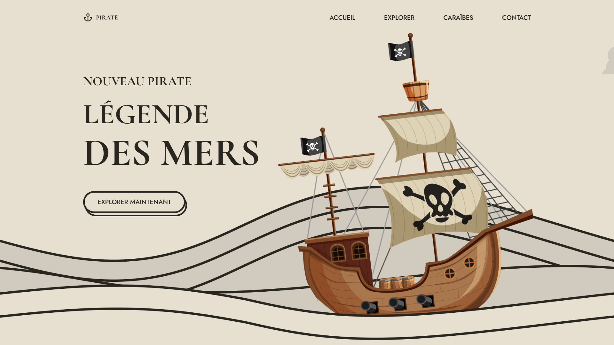

<div align="center">  
  <a href="https://background-animation-pirate.netlify.app/" target="_blank">  
      
  </a>  
  </br></br>  
  <h3 align="center">🏴‍☠️ Page Pirate Animée – Légende des Mers</h3>  
</div>

## <br /> 📌 Sommaire

&nbsp;&nbsp;&nbsp; 🎨 &nbsp; [**Introduction**](#introduction)<br />
&nbsp;&nbsp;&nbsp; 🛠️ &nbsp; [**Technologies**](#technologies)<br />
&nbsp;&nbsp;&nbsp; 🎯 &nbsp; [**Fonctionnalités**](#fonctionnalités)<br />
&nbsp;&nbsp;&nbsp; 🚀 &nbsp; [**Installation**](#installation)<br />

## <br /> <a name="introduction">🎨 Introduction</a>

Une landing page immersive sur le thème de la piraterie, avec animation des vagues, nuages en mouvement, et bateau flottant.  
Un design responsive, parfait pour sites événementiels, jeux ou projets maritimes narratifs.

Un univers graphique unique inspiré des légendes des mers.

## <br /> <a name="technologies">🛠️ Technologies</a>

- HTML5 sémantique
- CSS3 moderne (keyframes, variables, media queries)
- JavaScript ES6
- [Remix Icons](https://remixicon.com/)

## <br /> <a name="fonctionnalités">🎯 Fonctionnalités</a>

- Bateau flottant animé en CSS
- Parallaxe de vagues avec scroll infini
- Nuages animés en boucle
- Navigation mobile responsive avec menu toggle
- Effet ombre sur le header au scroll
- Appel à l’action animé “Explorer maintenant”
- Typographies marines et visuelles personnalisées
- Design adaptatif pour toutes résolutions

---

- Navigation fluide avec menu responsive
- Animation visuelle des vagues, nuages et bateau pirate
- Détection de scroll pour ombrer le header
- Design immersif inspiré de l’univers des pirates
- Interface adaptative pour tous les écrans

## <br /> <a name="installation">🚀 Installation</a>

### ✅ Prérequis

- [Google Chrome](https://www.google.com/) — Navigateur moderne
- [Visual Studio Code](https://code.visualstudio.com/) — Éditeur de code
- [Live Server](https://marketplace.visualstudio.com/items?itemName=ritwickdey.LiveServer) — Extension VS Code

### 📥 Cloner le projet

```bash
git clone https://github.com/ValentinMadiot/background-animation-pirate_js
cd background-animation-pirate_js
```

### ▶️ Lancer le projet

Ouvre simplement le fichier `index.html` dans ton navigateur, ou utilise **Live Server** pour le visualiser dynamiquement.
